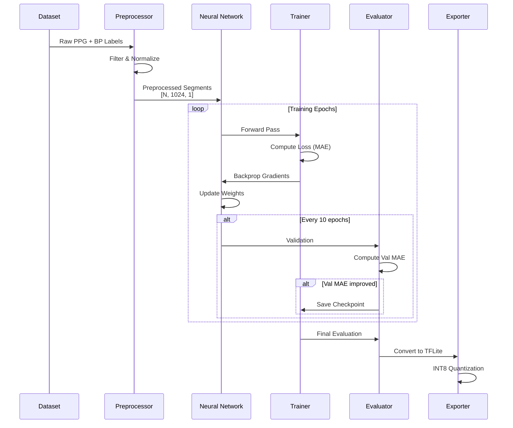

<div align="center">
  <h1>🧠 Deep PPG Research Core</h1>
  <p><strong>End-to-end research framework for PPG-based blood pressure prediction</strong></p>

  [](LICENSE)
  [](https://python.org)
  [](https://tensorflow.org)
  [](https://pytorch.org)
  [](#)

  [**Documentation**](https://github.com/BuccKyy/Deep-PPG-Research-Core/wiki) · [**Model Zoo**](#-model-zoo) · [**Datasets**](#-datasets) · [**Report Issue**](https://github.com/BuccKyy/Deep-PPG-Research-Core/issues)

  
</div>

---

## 📋 Table of Contents

- [Introduction](#-introduction)
- [Key Features](#-key-features)
- [Architecture](#-architecture)
- [Getting Started](#-getting-started)
- [Installation](#-installation)
- [Usage & Examples](#-usage--examples)
- [Configuration](#-configuration)
- [Project Structure](#-project-structure)
- [Model Zoo](#-model-zoo)
- [Datasets](#-datasets)
- [Contributing](#-contributing)
- [Roadmap](#-roadmap)
- [License](#-license)
- [Citation](#-citation)

---

## 🎯 Introduction

**Deep PPG Research Core** is a comprehensive machine learning framework for developing and evaluating deep neural networks that predict **blood pressure from photoplethysmography (PPG) signals**. This platform provides researchers with standardized tools for the complete ML pipeline—from raw signal acquisition to production-ready model deployment.

### The Research Challenge

Traditional blood pressure monitors require inflatable cuffs, making continuous, unobtrusive monitoring difficult. While PPG sensors offer a non-invasive alternative, accurately predicting BP from PPG signals remains challenging due to:

- **Signal quality variations** - Motion artifacts, noise, and sensor contact issues
- **Individual differences** - Age, BMI, skin tone, vascular health
- **Temporal dynamics** - BP changes throughout the day
- **Limited training data** - Difficulty collecting large-scale labeled datasets

### Our Contribution

This framework addresses these challenges through:

- 🔬 **Standardized pipelines** - Reproducible signal processing and evaluation
- 🧠 **State-of-the-art models** - CNN-LSTM, U-Net, ResNet, Transformers
- 📊 **Clinical validation** - AAMI/ESH evaluation protocols
- 🚀 **Production export** - TFLite/ONNX conversion for deployment
- 📚 **Open research** - Extensible architecture for novel approaches

### Who Is This For?

- 🏥 **Biomedical researchers** studying cuffless BP monitoring
- 🔬 **ML researchers** exploring signal processing with deep learning
- 🎓 **PhD students** working on physiological signal analysis
- 💻 **AI engineers** deploying health monitoring systems
- 📊 **Data scientists** analyzing time-series medical data

---

## ✨ Key Features

### 📡 Signal Processing Pipeline

- **Multi-stage filtering** - Butterworth, Chebyshev II, Savitzky-Golay filters
- **Quality assessment** - Automated Signal Quality Index (SQI) computation
- **Adaptive preprocessing** - Dynamic baseline removal and normalization
- **Feature engineering** - 50+ time/frequency/morphological features
- **Real-time streaming** - Serial/Bluetooth data acquisition from hardware

### 🧠 Model Zoo

| Architecture | SBP MAE | DBP MAE | Parameters | Inference | Best Use Case |
|-------------|---------|---------|------------|-----------|---------------|
| **CNN-LSTM** ⭐ | 5.2 mmHg | 3.8 mmHg | 2.1M | 50ms | Production deployment |
| **U-Net** | 6.1 mmHg | 4.5 mmHg | 3.5M | 65ms | Waveform analysis |
| **ResNet-1D** | 5.8 mmHg | 4.2 mmHg | 2.8M | 55ms | Feature learning |
| **Transformer** | 5.5 mmHg | 4.0 mmHg | 4.2M | 80ms | Long-range dependencies |
| **NABNet** | 5.4 mmHg | 3.9 mmHg | 3.2M | 60ms | Custom architecture |

*Evaluated on MIMIC-III + PulseDB test sets*

### 📊 Evaluation Suite

- **Clinical metrics** - MAE, RMSE, Pearson correlation, Bland-Altman
- **Cross-validation** - K-fold, Leave-One-Subject-Out (LOSO)
- **Generalization tests** - Performance across age, gender, BMI groups
- **Interpretability** - Grad-CAM, attention visualization, SHAP values

### 🔄 Experiment Tracking

- **TensorBoard integration** - Real-time training visualization
- **MLflow support** - Experiment versioning and comparison
- **Weights & Biases** - Cloud experiment tracking (optional)
- **Model checkpointing** - Automatic best model saving

---

## 🏗️ Architecture

### End-to-End ML Pipeline

```mermaid
graph TB
    subgraph "Data Acquisition"
        A[Raw PPG Signals<br/>Serial/BLE] --> B[Quality Check<br/>SQI > 0.7]
    end
    
    subgraph "Signal Processing"
        B --> C[Bandpass Filter<br/>0.5-10 Hz]
        C --> D[Baseline Removal<br/>Polynomial Detrend]
        D --> E[Normalization<br/>MinMax [0,1]]
        E --> F[Segmentation<br/>1024 samples]
        F --> G[Feature Extraction<br/>Time/Freq/Morph]
    end
    
    subgraph "Data Preparation"
        G --> H[Train/Val/Test Split<br/>70/15/15]
        H --> I[Data Augmentation<br/>Noise/Scale/Shift]
        I --> J[TFRecord Creation<br/>Optimized I/O]
    end
    
    subgraph "Model Training"
        J --> K[Model Architecture<br/>CNN-LSTM/U-Net/etc]
        K --> L[Training Loop<br/>Adam/Adadelta]
        L --> M[Validation<br/>Early Stopping]
        M --> N{Converged?}
        N -->|No| L
        N -->|Yes| O[Best Model]
    end
    
    subgraph "Evaluation"
        O --> P[Test Set Evaluation<br/>MAE, RMSE, r]
        P --> Q[Clinical Validation<br/>Bland-Altman]
        Q --> R[Model Export<br/>TFLite/ONNX]
    end
    
    style A fill:#e1f5ff
    style O fill:#ffe1e1
    style R fill:#e1ffe1
```

### Training Workflow



### Technology Stack

| Component | Technology | Purpose |
|-----------|-----------|---------|
| **Core Computing** | NumPy, SciPy | Numerical operations |
| **Deep Learning** | TensorFlow 2.13 / PyTorch 2.0 | Model training |
| **Signal Processing** | SciPy, PyWavelets | Filtering, transforms |
| **Data Handling** | Pandas, Polars | Data manipulation |
| **Visualization** | Matplotlib, Seaborn, Plotly | Plotting |
| **Experiment Tracking** | TensorBoard, MLflow, W&B | Training monitoring |
| **Medical Data** | WFDB | PhysioNet dataset access |
| **Model Export** | ONNX, TFLite | Production deployment |

---

## 🚀 Getting Started

### Prerequisites

**System Requirements:**
- Python 3.8 or higher
- 8GB+ RAM (16GB recommended for large datasets)
- 10GB disk space for datasets and experiments
- GPU with CUDA 11.2+ (optional but recommended for training)

**Knowledge Requirements:**
- Familiarity with Python and NumPy
- Basic understanding of deep learning
- Signal processing fundamentals (helpful but not required)

### Quick Start (5 minutes)

```bash
# 1. Clone repository
git clone https://github.com/BuccKyy/Deep-PPG-Research-Core.git
cd Deep-PPG-Research-Core

# 2. Create virtual environment
python -m venv venv
source venv/bin/activate  # Linux/Mac
# or: venv\Scripts\activate  # Windows

# 3. Install dependencies
pip install -r requirements.txt

# 4. Download sample dataset
python scripts/download_datasets.py --dataset sample --output datasets/raw/

# 5. Run example training
python training/train.py --config training/config/cnn_lstm_config.yaml --epochs 10
```

**Expected output:**
```
Dataset loaded: 1000 samples
Train: 700 | Val: 150 | Test: 150
Epoch 10/10 - loss: 6.2 - val_loss: 6.8
Training complete! Best MAE: 6.8 mmHg
Model saved: experiments/cnn_lstm_sample/best_model.h5
```

---

## 📥 Installation

### Option 1: Standard Installation

```bash
# Clone repository
git clone https://github.com/BuccKyy/Deep-PPG-Research-Core.git
cd Deep-PPG-Research-Core

# Install in development mode
pip install -e .

# Verify installation
python -c "import data_pipeline; print('Installation successful!')"
```

### Option 2: Docker (Recommended for Reproducibility)

```bash
# Build Docker image
docker build -t deep-ppg-research .

# Run container with GPU support
docker run --gpus all -it -v $(pwd):/workspace deep-ppg-research

# Inside container
python training/train.py --config training/config/cnn_lstm_config.yaml
```

### Option 3: Conda Environment

```bash
# Create conda environment
conda create -n deep-ppg python=3.8
conda activate deep-ppg

# Install dependencies
conda install -c conda-forge numpy scipy pandas matplotlib
pip install -r requirements.txt
```

### GPU Setup (Optional)

For CUDA-enabled GPU training:

```bash
# Install TensorFlow with GPU support
pip install tensorflow-gpu==2.13.0

# Or PyTorch with CUDA
pip install torch torchvision torchaudio --index-url https://download.pytorch.org/whl/cu118

# Verify GPU availability
python -c "import tensorflow as tf; print('GPUs:', tf.config.list_physical_devices('GPU'))"
```

---

## 📖 Usage & Examples

### Example 1: Train CNN-LSTM Model

```python
from training.train import Trainer
from models.architectures.cnn_lstm import create_cnn_lstm_model
from data_pipeline.preprocessing import load_dataset

# Load preprocessed data
train_data, val_data = load_dataset('datasets/processed/')

# Create model
model = create_cnn_lstm_model(
    input_shape=(1024, 1),
    cnn_filters=[32, 64, 128],
    lstm_units=[64, 32],
    dropout=0.25
)

# Initialize trainer
trainer = Trainer(
    model=model,
    optimizer='adam',
    loss='mae',
    metrics=['mae', 'rmse']
)

# Train
history = trainer.fit(
    train_data=train_data,
    val_data=val_data,
    epochs=100,
    batch_size=128,
    callbacks=['early_stopping', 'model_checkpoint']
)

# Evaluate
test_results = trainer.evaluate('datasets/processed/test/')
print(f"Test MAE: SBP={test_results['sbp_mae']}, DBP={test_results['dbp_mae']}")
```

### Example 2: Process Raw PPG Data

```python
from data_pipeline.preprocessing import filters, normalization
from data_pipeline.acquisition import PPGStreamer
import numpy as np

# Option A: Load from file
raw_signal = np.load('datasets/raw/subject_001.npy')

# Option B: Stream from device
streamer = PPGStreamer(port='/dev/tty.HC-05', baudrate=115200)
streamer.start()
raw_signal = streamer.get_buffer(samples=2048)

# Preprocess
filtered = filters.butterworth_bandpass(raw_signal, low=0.5, high=10, fs=100)
normalized = normalization.minmax_scale(filtered, feature_range=(0, 1))

# Segment into windows
segments = normalization.segment_signal(normalized, window_size=1024, overlap=0.5)

print(f"Created {len(segments)} segments from {len(raw_signal)} samples")
```

### Example 3: Evaluate Trained Model

```python
from evaluation.test_models import evaluate_model
from evaluation.bland_altman import plot_bland_altman

# Load model
model_path = 'experiments/cnn_lstm_run01/best_model.h5'

# Run evaluation
results = evaluate_model(
    model_path=model_path,
    test_data='datasets/processed/test/',
    metrics=['mae', 'rmse', 'correlation']
)

# Print results
print(f"SBP: MAE={results['sbp_mae']:.2f}, RMSE={results['sbp_rmse']:.2f}")
print(f"DBP: MAE={results['dbp_mae']:.2f}, RMSE={results['dbp_rmse']:.2f}")
print(f"Correlation: SBP={results['sbp_r']:.3f}, DBP={results['dbp_r']:.3f}")

# Generate Bland-Altman plot
plot_bland_altman(
    reference=results['reference_sbp'],
    predicted=results['predicted_sbp'],
    output='experiments/bland_altman_sbp.png'
)
```

### Example 4: Export Model for Deployment

```python
from evaluation.export.convert_tflite import convert_to_tflite

# Convert Keras model to TFLite
convert_to_tflite(
    model_path='experiments/cnn_lstm_run01/best_model.h5',
    output_path='deployment/models/cnn_lstm.tflite',
    quantize='int8',  # Options: 'float32', 'float16', 'int8'
    representative_dataset='datasets/processed/calibration/'
)

# Model is now ready for deployment to:
# - Android (TensorFlow Lite)
# - iOS (Core ML via conversion)
# - Edge devices (TensorFlow Lite Micro)
```

### Example 5: Jupyter Notebook Analysis

Open our interactive notebooks for exploration:

```bash
jupyter lab experiments/notebooks/

# Available notebooks:
# - 01_exploratory_analysis.ipynb - Dataset statistics
# - 02_signal_quality.ipynb - SQI analysis
# - 03_model_comparison.ipynb - Benchmark architectures
# - 04_hyperparameter_tuning.ipynb - Grid search
# - 05_interpretability.ipynb - Model visualization
```

---

## ⚙️ Configuration

### Training Configuration (YAML)

Create `training/config/my_config.yaml`:

```yaml
# Model Architecture
model:
  type: cnn_lstm  # Options: cnn_lstm, unet, resnet, transformer
  input_shape: [1024, 1]
  
  # CNN layers
  cnn_filters: [32, 64, 128]
  cnn_kernel_sizes: [5, 5, 3]
  cnn_activation: relu
  
  # LSTM layers
  lstm_units: [64, 32]
  lstm_dropout: 0.25
  
  # Dense layers
  dense_units: [64, 32]
  output_size: 2  # SBP, DBP

# Training Configuration
training:
  epochs: 100
  batch_size: 128
  learning_rate: 0.001
  optimizer: adam  # Options: adam, sgd, adadelta
  loss: mae  # Options: mae, mse, huber
  
  # Data
  train_split: 0.7
  val_split: 0.15
  test_split: 0.15
  shuffle: true
  
  # Augmentation
  augmentation:
    enabled: true
    noise_std: 0.01
    amplitude_scale: [0.9, 1.1]
    time_shift: 10

# Callbacks
callbacks:
  early_stopping:
    enabled: true
    patience: 15
    monitor: val_loss
    
  model_checkpoint:
    enabled: true
    save_best_only: true
    monitor: val_mae
    
  tensorboard:
    enabled: true
    log_dir: experiments/logs/
    
  reduce_lr:
    enabled: true
    factor: 0.5
    patience: 10
    min_lr: 0.00001

# Evaluation
evaluation:
  metrics: [mae, rmse, correlation]
  bland_altman: true
```

### Environment Variables

Create `.env` file:

```bash
# Dataset paths
DATASET_ROOT=./datasets/
MIMIC_PATH=/path/to/mimic-iii/
PULSEDB_PATH=/path/to/pulsedb/

# Experiment tracking
MLFLOW_TRACKING_URI=http://localhost:5000
WANDB_API_KEY=your_wandb_key  # Optional
TENSORBOARD_LOG_DIR=./experiments/logs/

# Model export
EXPORT_DIR=./deployment/models/
TFLITE_QUANTIZATION=int8

# Hardware
CUDA_VISIBLE_DEVICES=0
TF_GPU_MEMORY_GROWTH=true
```

---

## 📂 Project Structure

```
Deep-PPG-Research-Core/
│
├── data_pipeline/                  # Signal processing & acquisition
│   ├── acquisition/               # Real-time data streaming
│   │   ├── __init__.py
│   │   ├── stream_ppg.py         # Serial/BLE streaming
│   │   ├── stream_ble.py
│   │   └── find_port.py          # Auto-detect serial ports
│   ├── preprocessing/             # Signal preprocessing
│   │   ├── __init__.py
│   │   ├── filters.py            # Butterworth, Chebyshev, etc.
│   │   ├── normalization.py      # MinMax, Z-score
│   │   ├── segmentation.py       # Windowing
│   │   └── feature_extraction.py # Time/freq features
│   ├── visualization/             # Plotting utilities
│   │   ├── __init__.py
│   │   ├── plot_signals.py
│   │   └── plot_spectrograms.py
│   └── utils/
│       ├── __init__.py
│       ├── io_operations.py      # Load/save data
│       └── validators.py         # Data quality checks
│
├── models/                         # Deep learning models
│   ├── architectures/             # Model definitions
│   │   ├── __init__.py
│   │   ├── cnn_lstm.py           # CNN-LSTM hybrid ⭐
│   │   ├── unet.py               # U-Net variants
│   │   ├── resnet_1d.py          # 1D ResNet
│   │   ├── transformer.py        # Transformer models
│   │   └── nabnet.py             # Custom architecture
│   ├── losses/
│   │   ├── __init__.py
│   │   └── custom_losses.py     # Custom loss functions
│   └── metrics/
│       ├── __init__.py
│       └── evaluation_metrics.py # MAE, RMSE, etc.
│
├── training/                       # Model training
│   ├── dataset_preparation/
│   │   ├── __init__.py
│   │   ├── generate_tfrecord.py  # TFRecord creation
│   │   ├── data_loaders.py       # Data pipeline
│   │   └── augmentation.py       # Data augmentation
│   ├── config/                    # Training configs
│   │   ├── cnn_lstm_config.yaml
│   │   ├── unet_config.yaml
│   │   └── transformer_config.yaml
│   ├── callbacks/
│   │   ├── __init__.py
│   │   ├── early_stopping.py
│   │   └── model_checkpointing.py
│   └── train.py                   # Main training script
│
├── evaluation/                     # Model evaluation
│   ├── __init__.py
│   ├── test_models.py            # Test set evaluation
│   ├── cross_validation.py       # K-fold CV
│   ├── bland_altman.py           # Clinical validation
│   └── export/
│       ├── __init__.py
│       ├── convert_tflite.py     # TFLite conversion
│       └── convert_onnx.py       # ONNX export
│
├── experiments/                    # Experiment artifacts
│   ├── notebooks/                 # Jupyter analysis
│   │   ├── 01_exploratory_analysis.ipynb
│   │   ├── 02_signal_quality.ipynb
│   │   ├── 03_model_comparison.ipynb
│   │   ├── 04_hyperparameter_tuning.ipynb
│   │   └── 05_interpretability.ipynb
│   └── results/                   # Experiment outputs
│       ├── figures/              # Plots
│       ├── logs/                 # TensorBoard logs
│       └── metrics/              # Performance metrics
│
├── datasets/                       # Data storage
│   ├── raw/                       # Raw PPG signals
│   ├── processed/                 # Preprocessed data
│   ├── tfrecords/                 # Training-ready data
│   └── metadata.csv               # Dataset information
│
├── docs/                           # Documentation
│   ├── architecture.md            # System design
│   ├── signal_processing.md       # DSP algorithms
│   ├── model_zoo.md               # Model descriptions
│   ├── training_guide.md          # Training tutorials
│   └── api_reference.md           # API docs
│
├── tests/                          # Test suites
│   ├── test_preprocessing.py
│   ├── test_models.py
│   └── test_training.py
│
├── scripts/                        # Utility scripts
│   ├── download_datasets.py       # Get public datasets
│   ├── benchmark_models.py        # Performance comparison
│   └── export_production.py       # Deployment export
│
├── .github/                        # GitHub workflows
│   └── workflows/
│       ├── tests.yml              # Automated testing
│       └── docs.yml               # Documentation build
│
├── requirements.txt                # Python dependencies
├── setup.py                        # Package installation
├── README.md                       # This file
├── LICENSE                         # MIT License
└── .env.example                    # Environment template
```

---

## 🎨 Model Zoo

### Available Architectures

#### 1. CNN-LSTM (Recommended) ⭐

**Best for:** Production deployment, balanced performance

```python
from models.architectures.cnn_lstm import create_cnn_lstm_model

model = create_cnn_lstm_model(
    input_shape=(1024, 1),
    cnn_filters=[32, 64, 128],
    lstm_units=[64, 32],
    dropout=0.25
)
```

**Performance:**
- SBP MAE: 5.2 mmHg
- DBP MAE: 3.8 mmHg
- Parameters: 2.1M
- Inference: 50ms

#### 2. U-Net

**Best for:** Waveform-to-waveform mapping, signal enhancement

```python
from models.architectures.unet import create_unet_model

model = create_unet_model(
    input_shape=(1024, 1),
    depth=4,
    filters=64,
    dropout=0.3
)
```

**Performance:**
- SBP MAE: 6.1 mmHg
- DBP MAE: 4.5 mmHg
- Parameters: 3.5M

#### 3. ResNet-1D

**Best for:** Deep feature extraction, transfer learning

```python
from models.architectures.resnet_1d import create_resnet_model

model = create_resnet_model(
    input_shape=(1024, 1),
    num_blocks=4,
    filters=[64, 128, 256, 512]
)
```

**Performance:**
- SBP MAE: 5.8 mmHg
- DBP MAE: 4.2 mmHg
- Parameters: 2.8M

#### 4. Transformer

**Best for:** Long-range dependencies, attention analysis

```python
from models.architectures.transformer import create_transformer_model

model = create_transformer_model(
    input_shape=(1024, 1),
    num_heads=8,
    num_layers=4,
    d_model=128
)
```

**Performance:**
- SBP MAE: 5.5 mmHg
- DBP MAE: 4.0 mmHg
- Parameters: 4.2M

### Pre-trained Weights

Download pre-trained models:

```bash
# Download all models
python scripts/download_models.py --all

# Or specific model
python scripts/download_models.py --model cnn_lstm

# Models will be saved to: models/pretrained/
```

---

## 📊 Datasets

### Supported Public Datasets

#### 1. MIMIC-III Waveform Database

**Description:** ICU patient waveforms including PPG and arterial BP  
**Size:** 15,000+ segments  
**Access:** Requires PhysioNet credentialing

```bash
# Download (requires credentials)
python scripts/download_datasets.py --dataset mimic --credentials credentials.txt
```

#### 2. PulseDB

**Description:** Multi-site PPG database with demographics  
**Size:** 10,000+ segments  
**Access:** Open access

```bash
python scripts/download_datasets.py --dataset pulsedb
```

#### 3. Custom Device Data

**Description:** Data collected from your own PPG hardware

```bash
# Stream and save from device
python data_pipeline/acquisition/stream_ppg.py \
    --port /dev/tty.HC-05 \
    --output datasets/raw/custom_data.npy \
    --duration 300  # seconds
```

### Dataset Format

Expected TFRecord structure:

```python
{
    'ppg': tf.float32 [1024],      # PPG signal (normalized)
    'sbp': tf.float32,              # Systolic BP (mmHg)
    'dbp': tf.float32,              # Diastolic BP (mmHg)
    'subject_id': tf.string,        # Subject identifier
    'age': tf.int32,                # Age (years)
    'gender': tf.string,            # 'M' or 'F'
    'bmi': tf.float32               # Body mass index
}
```

---

## 🤝 Contributing

We welcome contributions from the research community!

### How to Contribute

1. **Fork and clone**
   ```bash
   git clone https://github.com/YOUR_USERNAME/Deep-PPG-Research-Core.git
   ```

2. **Create feature branch**
   ```bash
   git checkout -b feature/novel-architecture
   ```

3. **Make changes**
   - Add your model to `models/architectures/`
   - Include tests in `tests/`
   - Update documentation

4. **Run tests**
   ```bash
   pytest tests/
   ```

5. **Submit pull request**

### Research Contributions

We especially welcome:
- 🧠 Novel architectures for PPG-to-BP prediction
- 📊 New preprocessing techniques
- 🔬 Clinical validation studies
- 📚 Additional datasets
- 🔍 Interpretability methods

### Code Standards

- Follow PEP 8 style guide
- Add docstrings (Google style)
- Include type hints
- Write unit tests for new features
- Update relevant documentation

---

## 🗺️ Roadmap

### Current: v1.0

- ✅ 5 model architectures (CNN-LSTM, U-Net, ResNet, Transformer, NABNet)
- ✅ Complete signal processing pipeline
- ✅ TFRecord data loading
- ✅ TensorBoard integration
- ✅ TFLite export

### v1.1 (Q2 2026)

- [ ] PyTorch implementations of all models
- [ ] Optuna hyperparameter optimization
- [ ] Advanced data augmentation techniques
- [ ] Model ensembling support

### v1.2 (Q3 2026)

- [ ] Federated learning framework
- [ ] Privacy-preserving training (differential privacy)
- [ ] Multi-task learning (BP + HR + SpO2)
- [ ] AutoML architecture search

### v2.0 (Q4 2026)

- [ ] Web-based experiment dashboard
- [ ] Distributed training support
- [ ] ONNX Runtime optimization
- [ ] Clinical deployment toolkit

---

## 📄 License

This project is licensed under the **MIT License**:

```
MIT License

Copyright (c) 2026 BuccKyy

Permission is hereby granted, free of charge, to any person obtaining a copy
of this software and associated documentation files (the "Software"), to deal
in the Software without restriction...
```

See [LICENSE](LICENSE) for full text.

---

## 📖 Citation

If you use this framework in your research, please cite:

```bibtex
@misc{deep-ppg-research-core,
  author = {BuccKyy},
  title = {Deep PPG Research Core: A Comprehensive Framework for PPG-based Blood Pressure Prediction},
  year = {2026},
  publisher = {GitHub},
  url = {https://github.com/BuccKyy/Deep-PPG-Research-Core}
}
```

### Related Publications

*Publications using this framework will be listed here*

---

## 🙏 Acknowledgments

### Datasets & Resources

- **MIMIC-III** - PhysioNet Critical Care Database
- **PulseDB** - Multi-site PPG Database
- **TensorFlow & PyTorch** teams for ML frameworks

### Inspiration

- PPG2BP-Net (Liu et al., 2020)
- Deep Neural Networks for Cuffless BP (Harfiya et al., 2021)
- Signal Processing techniques from DSP literature

### Community

Thanks to all contributors, researchers, and the open-source community!

---

<div align="center">

## 💬 Support & Community

**Questions? Ideas? Let's collaborate!**

[](https://github.com/BuccKyy/Deep-PPG-Research-Core/discussions)
[](mailto:your-email@example.com)
[](https://twitter.com/your_handle)

### 🔗 Ecosystem

This research framework trains models deployed in:  
**[Cuffless BP IoT System](https://github.com/BuccKyy/Cuffless-BP-IoT-System)** - Production IoT deployment

**Found this useful?** Give us a ⭐ on GitHub!

[⬆ Back to Top](#-deep-ppg-research-core)

</div>

---

<div align="center">
  <sub>Built with ❤️ for the research community by <a href="https://github.com/BuccKyy">BuccKyy</a></sub>
</div>
